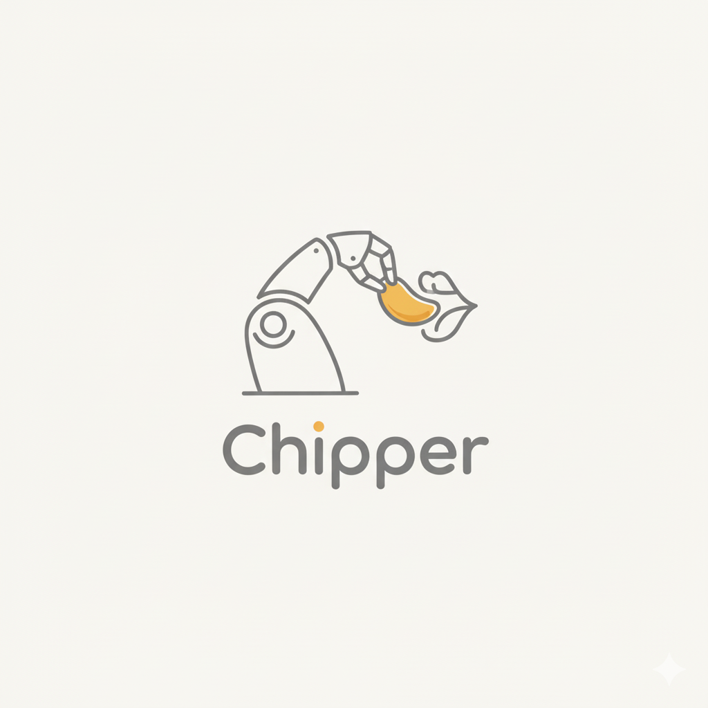
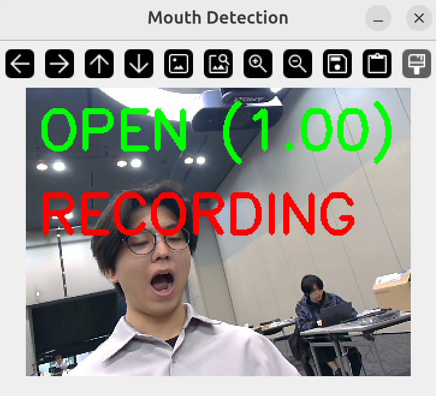
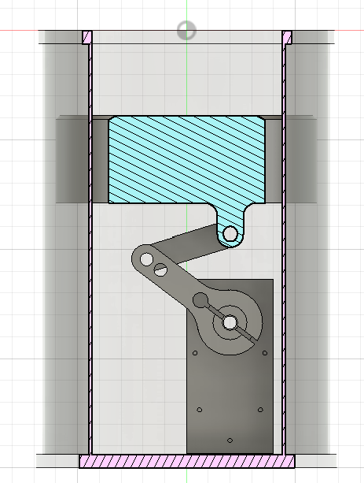

# 作品タイトル: Chipper

# 説明 / Description

このロボットを使うと、手を汚さずにポテトチップスを食べられます。ユーザーが口を開けると、ロボットがポテトチップスを取り出して口元まで運び、食べさせてくれます。

動作の流れは以下の通りです。

- 前方カメラが口の開きを検出すると、ロボットが起動します。
- ロボットがポテトチップスを取り出し、ユーザーの口元へ搬送します。ユーザーがチップスをくわえると、ロボットは待機位置へ戻ります。
- 次回に備え、ケース内のポテトチップスを持ち上げて供給準備をします。

このロボットにより、手指の油汚れを防ぎ、スマホや PC を清潔に保てます。

By using this robot, you can enjoy potato chips without getting your hands dirty. When the user opens their mouth, the robot picks up a chip and gently delivers it to the user.

Operation flow:

- The front-facing camera detects that the user’s mouth is open and activates the robot.
- The robot picks up a potato chip and carries it to the user’s mouth. When the user bites the chip, the robot returns to its standby position.
- The system lifts the remaining chips in the case to prepare for the next serving.

This keeps your hands clean and helps protect your smartphone and PC from oil stains.

# システム全体の構成 / System Overview

ユーザーの正面を向いた定点カメラで口の開閉を検知し、その情報をもとに ACT によって学習させたロボットアームを制御しています。ロボットアームには、ポテトチップスケースからポテトチップスを取り出し、ユーザーの口元まで運ぶ一連の動作を学習させています。

ユーザーがポテトチップスをくわえたことを画像認識によって検知すると、ロボットアームは元の位置へ帰還します。帰還後は BLE 通信を用いて、その情報をポテトチップスケース内部のマイコンへ送信し、サーボモータを駆動して次のポテトチップスを持ち上げる仕組みとなっています。

なお、口の開閉検知には YOLO を使用しています。

A fixed camera facing the user detects when the user’s mouth opens, and based on this information, a robot arm trained using ACT is controlled. The robot arm has learned a sequence of actions: picking up a potato chip from the chip case and delivering it to the user’s mouth.

When the system detects via image recognition that the user has bitten the potato chip, the robot arm returns to its original position. After returning, this status is transmitted via BLE communication to a microcontroller inside the potato chip case, which then drives a servo motor to lift the next potato chip into position.

YOLO is used for detecting the opening and closing of the user’s mouth.

# ハード側の工夫点 / Hardware Design

### ハンドの先端 / Hand Tip

ロボットハンドの先端には、TPU 製の爪にスポンジを貼り付けた構造を採用しています。柔らかい TPU とスポンジにより、ポテトチップスの破損を防ぎます。もちろん、利用者を傷つけることもありません。

At the tip of the robot hand, we use TPU claws with a sponge layer. The soft TPU and sponge help prevent damage to the chips and are safe for users.

### ポテトチップスケースの持ち上げ機構 / Case Lifting Mechanism

ケース内のポテトチップスの上下動には、サーボモータとスライダクランク機構を採用しています。筒状パッケージの内側を摺動ガイドとして利用することで、シンプルな構成を実現しました。サーボモータの採用により、送り量の調整も可能です。

We use a servo motor and a slider-crank mechanism to lift chips inside the case. By using the inside of the cylindrical package as a sliding guide, the system remains simple. The servo also enables adjustable feed rates.

# GitHub リポジトリ / GitHub Repository

https://github.com/charokoukuu/AMD_Robotics_Hackathon_2025_Chipper
